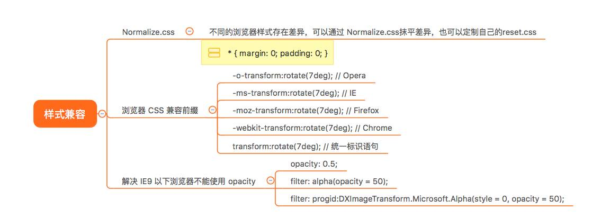
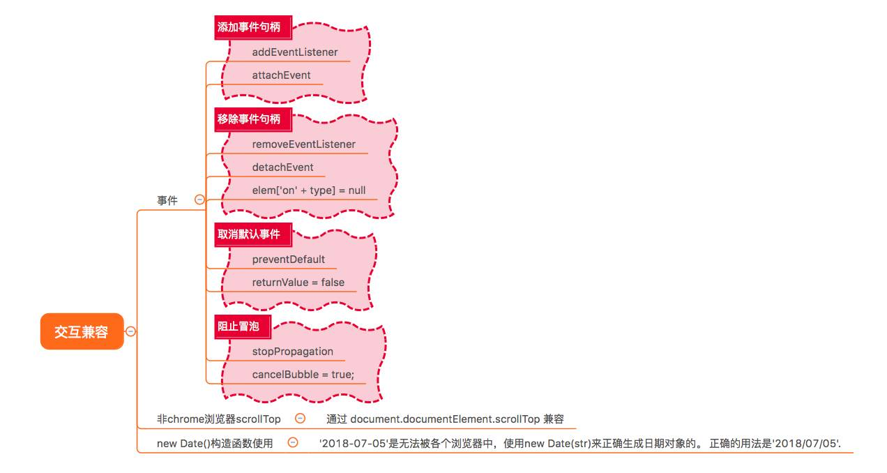

### 兼容性
+ css 方面
  
   + 部分css3属性前面要加上前缀
   + ie9以下不能使用opacity
     + opacity: 0.5;
     + filter: alpha(opacity = 50); //IE6-IE8我们习惯使用filter滤镜属性来进行实现
     + filter: progid:DXImageTransform.Microsoft.Alpha(style = 0, opacity = 50); //IE4-IE9都支持滤镜写法progid:DXImageTransform.Microsoft.Alpha(Opacity=xx)

+ js方面
  
   + 事件方面
   + 非chrome浏览器scrollTop需要通过 document.documentElement.scrollTop
   `

         var scrollTop = document.documentElement.scrollTop||document.body.scrollTop;

   `
   + new Data() '2020-2-28'是无法被浏览器生成正确日期对象的，需要通过2020/2/28

### 性能优化
+ css
  + 空的规则删除
  + 小于1的属性，用. 代替
  + 等于0的省略单位
  + 颜色值使用16进制
  + 合并多个 css
  + 减少嵌套
  + 少使用表达式
+ js
  + for循环length尽可能缓存起来
  + 为多个子元素添加事件使用事件委托
  + 插入多个dom元素，使用fragment
+ vue
  + 使用生产环境的vue代码
  + 路由懒加载
+ webpack
+ 其他
  + 服务端开启gzip
  + 使用雪碧图
  + 代码压缩
  + tinypng处理图片

### 如何seo  => search engine optimization (搜索引擎优化)
1. 网站结构布局优化，尽可能简单，提倡扁平化结构
    + 控制首页链接数量不要太多，尽可能跳转三次就能到达网站内的任何一个网页。
    + 导航尽可能使用文字，每个页面加上面包屑导航。
    + 利用布局，将重要的内容html代码放在最前面。
    + 控制页面的大小最好不要超过100k

2. 网页代码优化
    + <title>将重要的关键词放在title标签里的最前面，且不要重复。
    + meta设置keywords（几个就可以不要太多）和描述description。
    + 尽可能使用语义化的标签
    + 标签必须添加“alt”和“title”属性。
    + <a title="外部网站" el="nofollow"> 外部标签增加nofollow告诉蜘蛛不要往外爬。
    + 重要的内容不要使用js输出
    + 少使用iframe
    + 谨慎使用display:none; 因为搜索引擎会过滤其中的内容。

### 跨域
1. cors
+ 后端设置 (Access-Control-Allow-Origin, '*')

2. jsonp
+ 动态创建src

3. websocket

4. Proxy