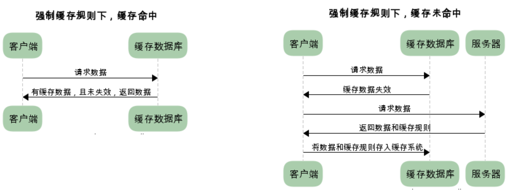
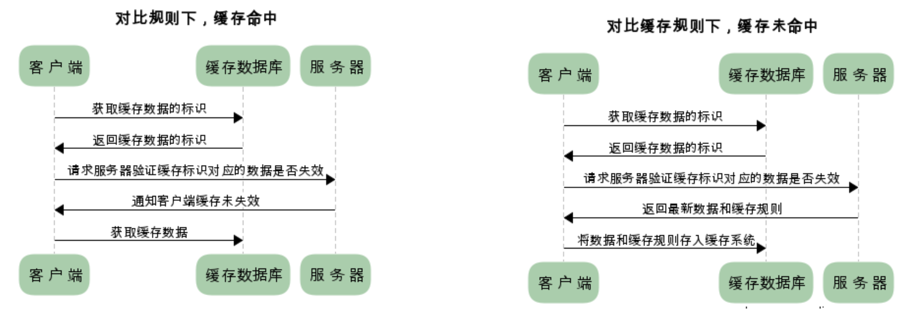

#### http缓存机制
https://juejin.im/post/5a1d4e546fb9a0450f21af23
+ 强制缓存

+ expires: 服务端返回的数据到期时间.当再次请求的时间小于返回的此时间，则直接使用缓存数据。
    + 缺点： 但由于服务器时间和客户端时间存在误差，这也导致缓存命中的误差。现在大多数使用cache-control来代替。
+ Cache-Control
    1. private: 客户端可以缓存
    2. public: 客户端和代理服务器都可以缓存
    3. max-age=time； 缓存内容将在t秒后失效
    4. no-cache：需要协商缓存来验证缓存数据
    5. no-store：所有内容都不会缓存
---
+ 协商缓存
+ 又称对比缓存，客户端会先从缓存数据库中获取到一个缓存数据的标识，得到标识后请求服务端验证是否失效（新鲜），如果没有失效服务端会返回304，此时客户端直接从缓存中获取所请求的数据，如果标识失效，服务端会返回更新后的数据。

+ Last-Modified： 服务器在响应请求时，会告诉浏览器资源的最后修改时间
+ if-Modified-Since: 浏览器再次请求的时候携带从缓存中获得的最后修改时间。服务器收到后会与last-modifed对比，如果一致则返回304和响应报文头，浏览器只需要从缓存中获取信息即可。
----
+ Etag：服务器响应请求时，通过此字段告诉浏览器当前资源在服务器生成的唯一标识（生成规则由服务器决定）
+ If-None-Match： 再次请求服务器时，浏览器的请求报文头部会包含此字段，后面的值为在缓存中获取的标识。服务器接收到次报文后发现If-None-Match则与被请求资源的唯一标识进行对比。
+ 缺点：但是实际应用中由于Etag的计算是使用算法来得出的，而算法会占用服务端计算的资源，所有服务端的资源都是宝贵的，所以就很少使用Etag了。

#### 缓存的优点
1. 减少了冗余的数据传递，节省宽带流量
2. 减少了服务器的负担，大大提高了网站性能
3. 加快了客户端加载网页的速度 这也正是HTTP缓存属于客户端缓存的原因。

### 从输入URL到加载页面的过程
1. DNS解析：将url解析为ip地址
   + 浏览器DNS缓存
   + 系统DNS缓存
   + 路由器缓存
   + 运营商缓存
   + 递归搜索 例如www.baidu.com
     1. 查找.com
     2. 查找.baidu
     3. 查找www

2. TCP连接三次握手
   + 第一次，由浏览器发起，通知服务器，我要发送请求了；
   + 第二次，由服务器发起，通知浏览器，我要准备接受请求了；
   + 第三次，由浏览器发起，通知服务器，我马上就要发了，准备接受吧；

3. 发送http请求

4. 响应请求

5. 渲染页面
    + 解析HTML为DOM树；
    + 解析CSS为CSSOM树；
    + 上面两步是同时进行的；
    + 将DOM树和CSSOM树解析为渲染树，根据渲染树计算布局，并计算每个节点的几何信息，将颜色绘制到屏幕上；

6. 关闭连接 四次挥手

#### http和https的区别

#### http方法
#### http状态代码
#### tcp与udp的区别
#### 为什么三次握手，四次挥手
